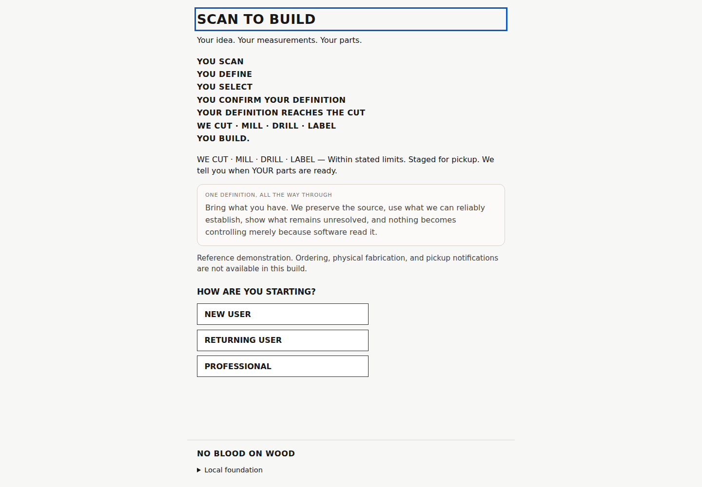
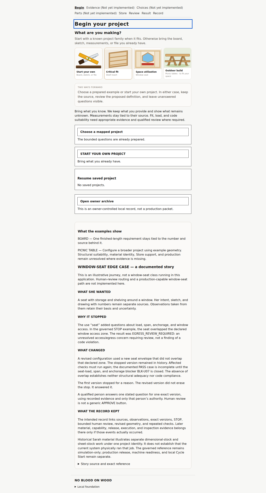
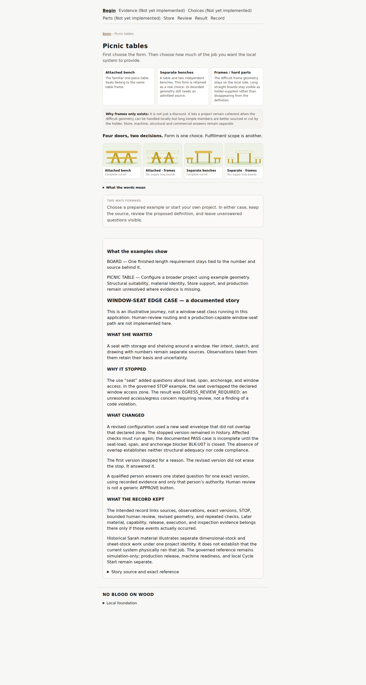
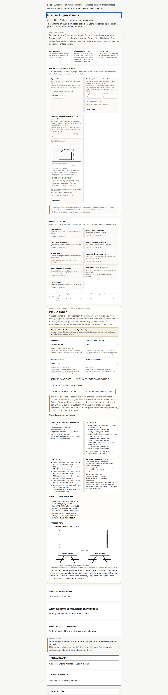
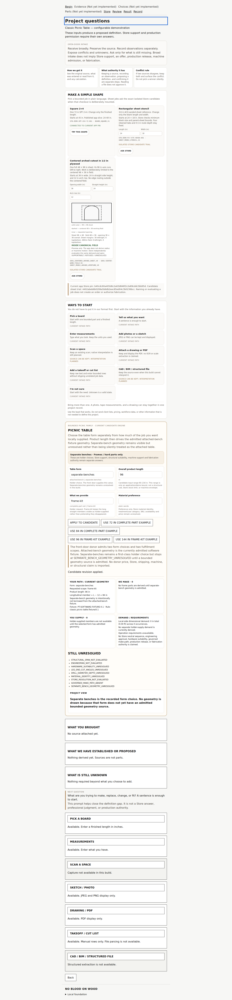

# Scan-to-Build — current visual checkpoint

**Source branch:** `fix/restore-donor-flow-0.1`  
**Source commit:** `4d64bd7c62a68dd9c934d5c62bd8c6e69472e39f`  
**Generated:** 2026-09-14T11:23:12.152Z

This page is generated from the actual `apps/stb` application source. It is a visual review surface only. It does not add Store, machine, commercial, ordering, payment, reservation, or fabrication authority.

If the branch or commit above is not the work you intend to review, do not treat these screenshots as current.

## 1. Landing

## 2. Project doors

## 3. Picnic family chooser

## 4. Attached bench — frames only

## 5. Separate benches — retained but unresolved geometry

---

**NO BLOOD ON WOOD.**
